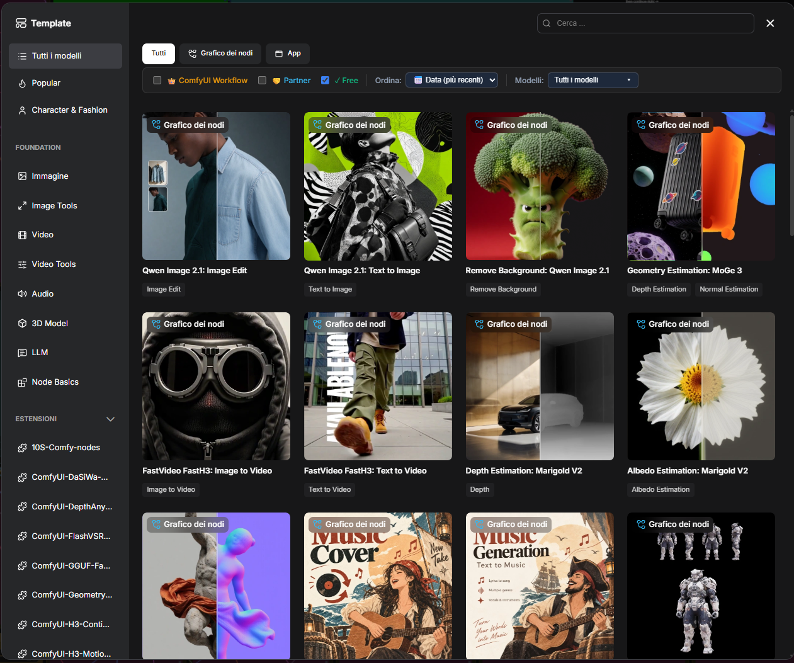

# ComfyUI-Clean-Templates

A lightweight frontend extension for **ComfyUI** that enhances the built-in **Workflow Templates** library with powerful category filters, model family multi-selection, and custom sorting.



---

## ✨ Features

- 👑 **ComfyUI Workflow**: Toggle visibility of ComfyUI / cloud credit / API-based workflow templates.
- 🤝 **Partner Workflows**: Toggle visibility of official partner workflows (bearing the partner badge).
- ✓ **Free / Local Workflows**: Focus solely on free, open-source local models and workflows.
- 🔀 **Flexible OR Logic**: Select one, two, or all three categories simultaneously (with a minimum of one category always active to guarantee results).
- 🧠 **Smart Model Families**: Easily filter by major model families in **AND** logic (e.g. *Flux (All)*, *Wan Video*, *MiniMax*, *Qwen*, *SDXL*, *SD 1.5*, *Hunyuan*, *LTX Video*, and more) or choose specific model tags.
- 📅 **Custom Sorting**: Sort templates by:
  - 📅 **Release Date** (Newest first)
  - 🔤 **Alphabetical** (A-Z)
  - 🔥 **Popularity** (Most used)
- ⚡ **Real-Time Reactive Performance**: Built on Pinia store-level reactive interceptors. Zero lag, zero UI flickering, and native Vue 3 lazy-pagination & infinite-scroll are 100% preserved.
- 📊 **Accurate Counter**: Displays exact count of matching templates versus total available library templates in the dialog footer.

---

## 📦 Installation

### Method 1: Git Clone (Recommended)

1. Open a terminal in your ComfyUI installation directory.
2. Navigate to your `custom_nodes` folder:
   ```bash
   cd custom_nodes
   ```
3. Clone this repository:
   ```bash
   git clone https://github.com/YOUR_USERNAME/ComfyUI-Clean-Templates.git
   ```
4. Restart ComfyUI (or reload your browser page with **Ctrl + F5**).

### Method 2: Manual Download

1. Download this repository as a `.zip` archive.
2. Extract the archive into `ComfyUI/custom_nodes/`.
3. Ensure the folder is named `ComfyUI-Clean-Templates`.
4. Restart ComfyUI.

---

## 🖥️ Usage

1. Open the **Workflow Templates** dialog inside ComfyUI (from the sidebar or menu).
2. The custom toolbar appears directly in the template header bar:
   - Check or uncheck **👑 ComfyUI Workflow**, **🤝 Partner**, and **✓ Free**.
   - Pick your desired sort order (**📅 Data**, **🔤 Alfabetico**, **🔥 Popolari**).
   - Click **Modelli** to select one or more model families or tags.
3. Templates update immediately in real time.

---

## 📄 License

This project is licensed under the [MIT License](LICENSE).

